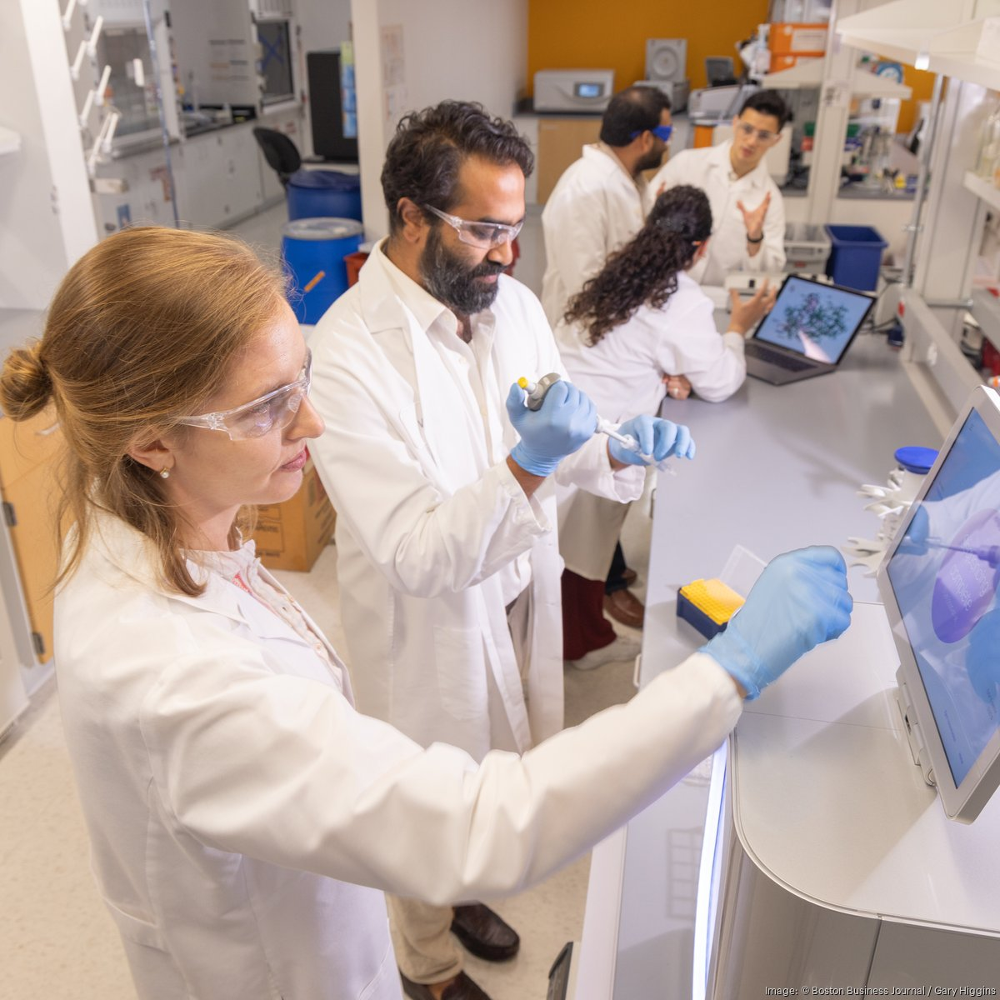

# 🧬 The Future of Biotechnology & AI

Soon, Machine Learning and AI will solve all the issues and wonders of the human body. To achieve this, the world needs two kinds of people: **ML Scientists** to make the AI smarter, and **BioML Specialists** to finetune this intelligence to solve life's biggest unsolved mysteries.

| ❌ **The Past** | ✅ **The Future** | ✅ **The Future** |
| :---: | :---: | :---: |
|  |  |  |
| *Traditional Medicine* | *ML Scientist* | *BioML Specialist* |

We are on the brink of answering the ultimate questions: *What are we made of? Do we have a soul? Can we live forever? How is the brain so complex? Is there no limit to intelligence?*

Imagine a future where we can all become the best versions of ourselves—never sad, never weak, and perhaps, never having to die.

Welcome to the exciting world of Biotechnology! This guide will give you a high-level overview of what this field is, how Artificial Intelligence (AI) is revolutionizing it, and what the world might look like in 2030.

## 🌱 What is Biotechnology?

**Biotechnology** (Biotech) is simply **technology based on biology**. It harnesses cellular and biomolecular processes to develop technologies and products that help improve our lives and the health of our planet.

Think of it as using nature's own toolkit—cells, DNA, proteins—to build things.

**Examples you might know:**
*   **Bread & Cheese:** Using yeast and bacteria (ancient biotech!).
*   **Insulin:** Genetically modified bacteria produce insulin for diabetics.
*   **Vaccines:** mRNA vaccines (like for COVID-19) are a triumph of modern biotech.

---

## 🤖 The AI Revolution in Biotech

You've heard of AI writing essays or generating images, but its most profound impact might be in biology. Biology is complex and "noisy," making it hard for humans to analyze alone. AI loves complex data.

### 1. AlphaFold: Solving the Protein Puzzle
Proteins are the microscopic machines that do everything in your body. Their function depends on their 3D shape. For 50 years, predicting this shape was one of the hardest problems in science.
*   **The Breakthrough:** Google DeepMind's **AlphaFold** used AI to predict the shape of nearly *all* known proteins.
*   **Why it matters:** It accelerates drug discovery by years. Instead of guessing, scientists can now "see" the targets they are designing drugs for.

### 2. Drug Discovery
Traditionally, making a new drug takes 10-15 years and costs billions.
*   **AI's Role:** AI can simulate how billions of potential molecules interact with a disease target, finding the best candidates in weeks instead of years.

### 3. Personalized Medicine
Everyone's DNA is unique. AI can analyze your specific genetic makeup to predict which treatments will work best for *you*, moving us away from "one size fits all" medicine.

---

## 🧠 Neuralink & The Brain-Chip Interface

While some biotech focuses on cells, others focus on the most complex organ: the brain.

**Neuralink**, founded by Elon Musk, is building a **Brain-Computer Interface (BCI)**.
*   **The Link:** A coin-sized chip implanted in the skull with ultra-fine threads (thinner than a hair) that read neuron spikes.
*   **Telepathy:** The first goal is to let people control a computer cursor or keyboard using *only their thoughts*. In 2024, the first human patient, Noland Arbaugh, played online chess and Civilization VI purely with his mind!
*   **Blindsight:** A future goal to restore vision to the blind by bypassing the eye and sending signals directly to the visual cortex.

> "The future is not just about AI, but about merging human intelligence with artificial intelligence."

---

## 🌍 20 Biotech Companies Changing the World

Here are 20 of the most innovative companies pushing the boundaries of biology and AI:

1.  **[Google DeepMind](https://deepmind.google/):** Solved the 50-year-old "protein folding problem" with AlphaFold.
2.  **[CRISPR Therapeutics](https://crisprtx.com/):** Using gene editing to cure genetic diseases like Sickle Cell Anemia.
3.  **[Colossal Biosciences](https://colossal.com/):** Working on "de-extinction" to bring back the Woolly Mammoth.
4.  **[Altos Labs](https://altoslabs.com/):** A well-funded startup focused on cellular rejuvenation programming to reverse aging.
5.  **[Ginkgo Bioworks](https://www.ginkgobioworks.com/):** The "organism company" that designs custom microbes for everything from perfume to fertilizer.
6.  **[Moderna](https://www.modernatx.com/):** Pioneers of mRNA technology, creating "software for life" to fight viruses and cancer.
7.  **[Insilico Medicine](https://insilico.com/):** Using Generative AI to design novel drugs for fibrosis and cancer.
8.  **[Recursion](https://www.recursion.com/):** An AI-first biotech using massive datasets and automation to discover new drugs.
9.  **[BioNTech](https://www.biontech.com/):** Famous for the COVID vaccine, now using mRNA to develop personalized cancer therapies.
10. **[Vertex Pharmaceuticals](https://www.vrtx.com/):** Created the first medicines to treat the underlying cause of Cystic Fibrosis.
11. **[Illumina](https://www.illumina.com/):** The global leader in DNA sequencing technology (reading the code of life).
12. **[10x Genomics](https://www.10xgenomics.com/):** Building tools to analyze biology at the single-cell level.
13. **[Mammoth Biosciences](https://mammoth.bio/):** Co-founded by Nobel laureate Jennifer Doudna to build CRISPR-based diagnostics.
14. **[Beam Therapeutics](https://beamtx.com/):** Developing "base editing" (a more precise version of CRISPR) to fix single-letter genetic errors.
15. **[Isomorphic Labs](https://www.isomorphiclabs.com/):** A DeepMind spinoff solely focused on using AI to reimagine the drug discovery process.
16. **[Twist Bioscience](https://www.twistbioscience.com/):** Manufacturing synthetic DNA on silicon chips at scale.
17. **[Grail](https://grail.com/):** Developing a simple blood test to detect over 50 types of cancer early.
18. **[Generate:Biomedicines](https://generatebiomedicines.com/):** Using machine learning to generate entirely new protein therapeutics.
19. **[Calico](https://www.calicolabs.com/):** A Google-backed R&D company focused on understanding the biology of aging.
20. **[OpenAI](https://openai.com/):** While known for ChatGPT, their models are increasingly being applied to biological reasoning and healthcare.

---

## 🎓 Top Schools for Biotech & Bioengineering

If you want to study this field, here are some of the best universities in the world for Biotechnology and Bioengineering:

*   **Massachusetts Institute of Technology (MIT):** The global leader in Biological Engineering and Synthetic Biology.
*   **Stanford University:** Famous for its Bioengineering department and proximity to Silicon Valley biotech startups.
*   **Harvard University:** World-class research in genetics and life sciences.
*   **University of California, Berkeley:** A pioneer in CRISPR technology and bioengineering.
*   **Johns Hopkins University:** Consistently ranked #1 for Biomedical Engineering.
*   **University of Cambridge (UK):** Historic excellence in biological sciences.
*   **ETH Zurich (Switzerland):** A top European hub for biotechnology and engineering.
*   **University of California, San Diego (UCSD):** A major hub for biotech research and industry partnerships.

---

## 💼 Careers & The Future Industry

Biotech is the "Internet of the 2020s"—a booming industry with room for everyone, from scientists to coders.

### Career Paths
*   **Bio-Engineer:** Designing new biological machines or lab-grown tissues.
*   **Computational Biologist:** Using code (Python!) to analyze DNA data.
*   **AI Research Scientist:** Building the models that discover new drugs.
*   **The Biotech Founder:** You don't need a PhD to start a company. Many modern founders combine a science background with business skills to launch startups that solve massive problems.

---

## 🚀 Vision 2030: The First Generation Not To Die?

By 2030, the convergence of Biotech and AI could lead to a world where aging is treated as a manageable condition, not an inevitability.

*   **Longevity & Healthspan:** Scientists are working on "Cellular Reprogramming" (using factors to turn old cells back into young ones) and "Senolytics" (drugs that kill "zombie" cells that cause aging).
*   **Curing the Incurable:** Genetic diseases (like Cystic Fibrosis) could be cured once and for all using gene-editing tools like **CRISPR**, designed with AI precision.
*   **Lab-Grown Meat:** Sustainable meat grown from cells, not animals, reducing the environmental impact of farming.
*   **Preventative Health:** Wearables and AI will predict illness *before* you feel sick.

We might be the first generation to have the choice to live radically longer, healthier lives.

> **Real-World Example:** Tech entrepreneur **Bryan Johnson** is currently spending millions to reverse his biological age, treating his body like a computer algorithm.
> *   [Watch: Don't Die - Bryan Johnson Documentary](https://www.youtube.com/watch?v=kf9e1o7rUeo)

---

## 📚 Resources to Learn More

*   **YouTube:**
    *   [Kurzgesagt – In a Nutshell](https://www.youtube.com/user/Kurzgesagt) (Beautiful animations explaining biology)
    *   [DeepMind: AlphaFold](https://www.youtube.com/watch?v=gg7WjuFs8F4) (Short documentary on the protein breakthrough)
    *   [Neuralink Show and Tell](https://www.youtube.com/watch?v=YreDYmXTYiA) (See the technology in action)
*   **News:**
    *   [Stat News - Biotech](https://www.statnews.com/category/biotech/)
    *   [Nature Biotechnology](https://www.nature.com/nbt/)
*   **Kaggle:** A platform for data science projects (we will use this next!).

---

**Next Step:** Open `01_Jupyter_Basics.ipynb` to start your coding journey!
