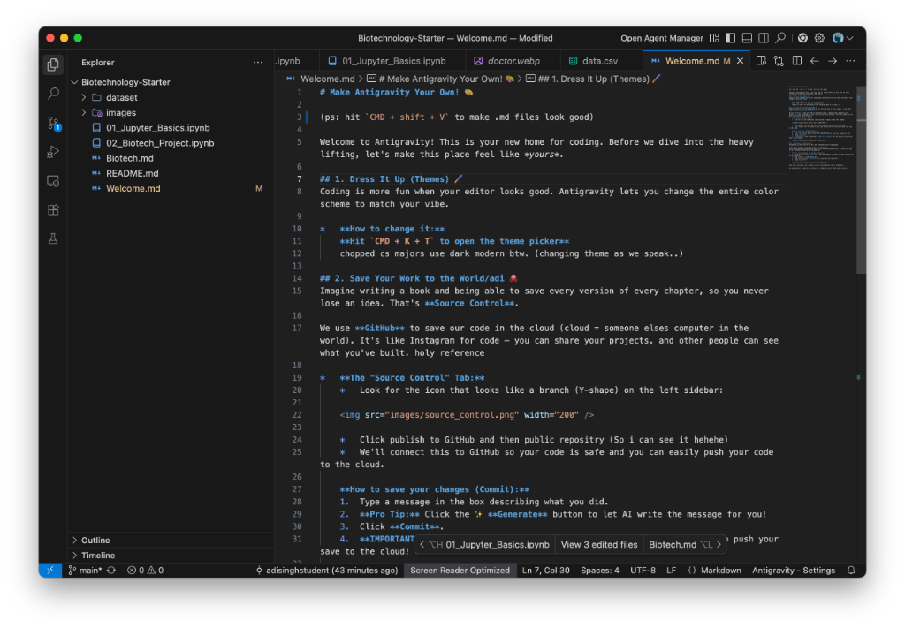

# Getting Started with Biotechnology Starter 🧬

Welcome to your Biotechnology learning journey! Follow these steps to get everything set up.

## 1. Install Google Antigravity 🚀

First, you need to install our powerful code editor, **Google Antigravity**.

1.  Go to the official [Google Antigravity installation page](https://antigravity.google/).
2.  Download the installer for your computer (Mac or Windows).
3.  Run the installer and follow the on-screen instructions.

## 2. Clone the Repository 🐙

Now, let's get the code for this project onto your computer.

### Option A: The Easy Way (Paste Link)
1.  Open **Google Antigravity**.
2.  On the Welcome screen (or in the Command Palette `Cmd+Shift+P`), look for **"Clone Repository"**.
3.  Paste this link:
    ```
    https://github.com/adisinghstudent/Biotechnology-Starter
    ```
4.  Press **Enter** and choose a folder to save it in.

### Option B: The Hacker Way (Terminal)
1.  Open your terminal.
2.  Type the following command and press **Enter**:
    ```bash
    git clone https://github.com/adisinghstudent/Biotechnology-Starter
    ```

## 3. Open the Project

Once cloned, **Google Antigravity** should ask if you want to open the repository. Click **Open**.

Now you are ready to start learning! Open `Welcome.md` to customize your editor.

## 4. Setup Your Editor 🛠️

To get the best experience, make sure your editor looks like this:

1.  **Be in Editor Mode**: Ensure you are in the standard code editing view.
2.  **Close Agent Manager**: Do not click "Open Agent Manager".
3.  **Simplify the View**: Close all buttons/sidebars beside the Agent Manager for simplicity.

Your setup should look exactly like this:



## 5. Your Learning Path 🎓

Follow this order to become a biotech pro:

1.  **Start with `Welcome.md`**: This file will help you customize your editor and make it yours.
2.  **Read `Biotech.md`**: Get inspired! Read about the future of biotechnology and why it matters.
3.  **Dive into the Notebooks**:
    *   `01_Jupyter_Basics.ipynb`: Learn the tools of the trade.
    *   `02_Biotech_Project.ipynb`: Do your first data science project!

> **Pro Tip**: When you open a `.md` (Markdown) file, hit `Cmd + Shift + V` to see the pretty preview version! ✨
