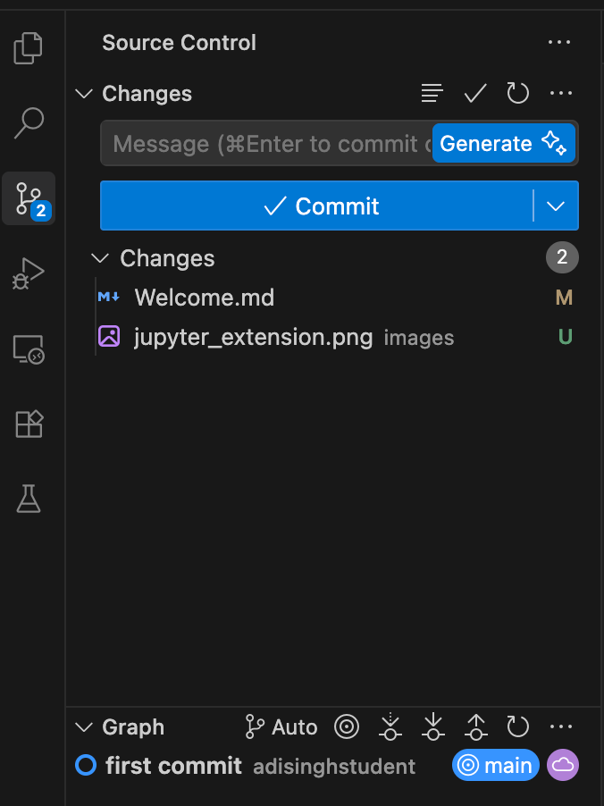
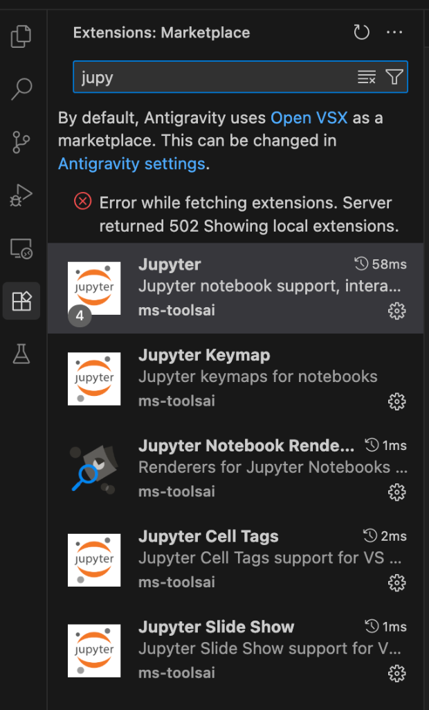

# Make Antigravity Your Own! 🎨

(ps: hit `CMD + shift + V` to make this look good)

Welcome to Antigravity! This is your new home for coding. Before we dive into the heavy lifting, let's make this place feel like *yours*.

## 1. Dress It Up (Themes) 🖌️
Coding is more fun when your editor looks good. Antigravity lets you change the entire color scheme to match your vibe.

*   **How to change it:**
    **Hit `CMD + K + T` to open the theme picker**
    chopped cs majors use dark modern btw. (changing theme as we speak..)
    
## 2. Save Your Work to the World/adi 🐙
Imagine writing a book and being able to save every version of every chapter, so you never lose an idea. That's **Source Control**.

We use **GitHub** to save our code in the cloud (cloud = someone elses computer in the world). It's like Instagram for code – you can share your projects, and other people can see what you've built. holy reference

*   **The "Source Control" Tab:**
    *   Look for the icon that looks like a branch (Y-shape) on the left sidebar:
    
    

    *   Click publish to GitHub and then public repositry (So i can see it hehehe)
    *   We'll connect this to GitHub so your code is safe and you can easily push your code to the cloud.

    **How to save your changes (Commit):**
    1.  Type a message in the box describing what you did.
    2.  **Pro Tip:** Click the ✨ **Generate** button to let AI write the message for you!
    3.  Click **Commit**.
    4.  **IMPORTANT:** After committing, click **Sync Changes** (or the arrows) to push your save to the cloud! ☁️

    

## 3. Superpowers (Extensions) 🧩
Antigravity is great out of the box, but Extensions give it superpowers.

**We need one specific superpower right now: Jupyter.**
Since we are going to be doing some data science and biotechnology work, we need to be able to run "Notebooks" right here in Antigravity.

*   **Action Item: Download the Jupyter Extension**
    1.  Click on the **Extensions** icon on the left sidebar (it looks like four squares with one flying away).
    2.  Type `Jupyter` in the search bar.
    3.  Look for the one by **Microsoft** (it should be the top result).
    4.  Click **Install**.
    
    

Once that's installed, you're ready to start running Python code in notebooks! 🚀
